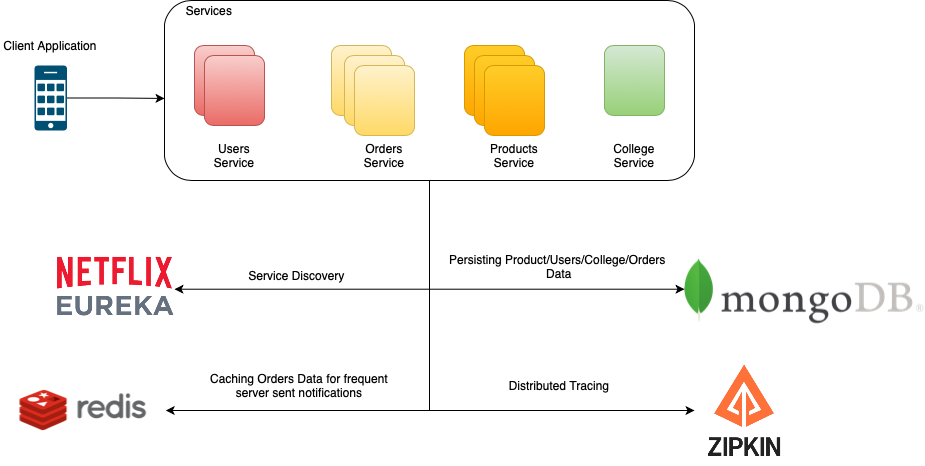
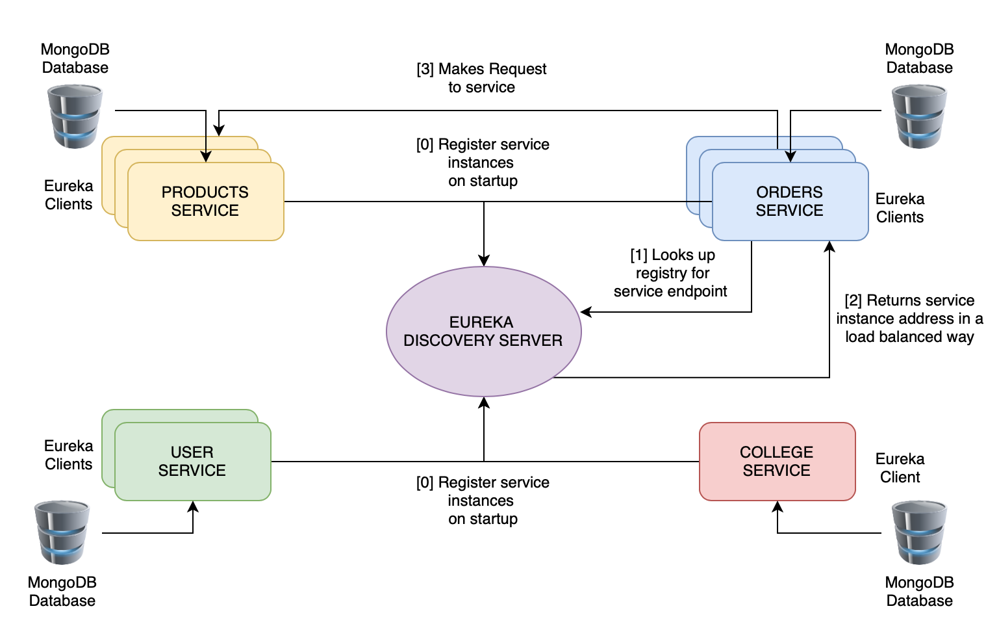

# Rentals-Spring-Boot-Microservices
Backend services are the heart and soul of every application, and so a lot of things like the type of database(DB) to use, minimising DB interactions and API calls, implementing efficient caching and load-balancing mechanisms, scalability, cost-efficiency, etc. have to be kept in mind while writing a production-grade application's backend services.
Starting with the basics, I implemented a microservices based architecture as backend for my flutter application called "College OLX" using Spring Boot. The figure below shows how microservices architecture arranges an application as a collection of loosely coupled services which can be modified and scaled independently.

## High Level Design
<p align= "center">
<br>
</p>


## Service Interaction
<p align= "center">
<br>
</p>
The following services have been implemented which handle queries related to them:
<ul>
   <li> Users Service</li>
   <li> Products Service </li>
  <li> Colleges Service </li>
  <li> Orders Service </li>
</ul>

Inter-service communication happens through Eureka Server so an additional *Discovery Server* has also been implemented. The schematic diagram above represents how *Orders Service* communicates with *Products service* through Eureka Server. Following are the steps:

<ul>
   <li> At their startup, each of the four services register themselves with the Discovery Server </li>
   <li> When one service requires to communicate with the other, it looks up the Discovery Server for the target service's address </li>
   <li> The Discovery Server returns the address of the required service in a load-balanced way if more than one instances of the target service is active </li>
   <li> Request is now made to the target service from the client service </li>
</ul>

This type of service discovery is known as client-side service discovery as client is the one doing all the work!
   

## Service initiation
[Spring Initializer](https://start.spring.io) has been used to create spring applications of the above mentioned services(except Discovery Server) with the following dependencies:
<ul>
   <li> Spring Web </li>
   <li> Spring Data MongoDB</li>
   <li> Eureka Discovery Client</li>
</ul>

For Discovery server only one dependency of "Eureka Server" has been used.

### Discovery Server
Eureka servers have a tendency of registering themselves to enable communication between multiple Eureka servers. But since we only have one discovery server, we don't need it to register itself. So add the following lines to *application.properties* file:
```
eureka.client.register-with-eureka=false
eureka.client.fetch-registry=false
```
Next, add the following annotation the DiscoveryServerApplication class in *DiscoveryServerApplication.java* file to mark the application as an Eureka Server:
```
@EnableEurekaServer
```
Now Run the application. By default it will run in port 8761, which can be altered by specifying the *server.port* property.

### User, College, Order and Product Services
Specify the following properties for each of the four services in their *application.properties* file:
```
server.port=port_number_for_each_service
spring.data.mongodb.database=db_name_for_each_service
spring.data.mongodb.port=27017
spring.application.name=service-name
```
Add the Eureka Client Annotation to the application's main java class:
```
@EnableEurekaClient
```
After doing so for all the four services, run them and check Eureka Server's url (by default in port 8761) to see if your services have been registered.
**Note:** Make sure MongoDB is active in your machine before running the above services.

## MongoDB integration
Create a model class to specify the structure of objects to be stored in the database. Orders service has the following model class:
```
public class Order {
    @Id
    private String id;

    private String sellerId;
    private String renterId;
    private String productId;
    private String status;
    private String userStatus;
    private long timestamp;

    public Order() { }

    public Order(String sellerId, String renterId, String productId, String status, String userStatus, long timestamp) {
        this.sellerId = sellerId;
        this.renterId = renterId;
        this.productId = productId;
        this.status = status;
        this.userStatus = userStatus;
        this.timestamp = timestamp;
    }
    //INCLUDES GETTERS AND SETTERS...
 }
```
**Note**: The empty constructor is for RestTemplate.<br>
Create a repository file to act as an interface between your application and the mongoDB database. The following *OrderRespository* interface extends the *MongoRepository* interface and so its methods like *findById* can be called using an object of *OrderRepository*.
```
public interface OrderRepository extends MongoRepository<Order, String> {
    List<Order> findByRenterIdAndStatus(String renterId, String status, Sort sort);
    List<Order> findBySellerIdAndStatus(String sellerId, String status, Sort sort);
    List<Order> findByProductIdAndStatus(String productId, String status);
}
```
**Spring manages the implementations of the above methods (Cool, right!?)**

## BASIC APIs
Create a REST controller class which tells the application where to route http requests. Following is the controller class for *Orders Service*:
```
@RestController
@RequestMapping(value = "/order")
public class OrderController {
    @Autowired
    private OrderRepository orderRepository;

    @GetMapping("/getAll")
    public ResponseEntity<List<Order>> getAllOrders(){
        List<Order> orders = orderRepository.findAll();
        return new ResponseEntity<>(orders, HttpStatus.OK);
    }
 }
```
All the requests made to *Orders Service* with */order* suffix in the URL are mapped to methods of this class. So, a GET request to *http://localhost:service_port/order/getAll* is routed to the *getAllOrders* function. *Autowired* annotation makes sure that only one object of the OrderRepository class is formed. That's how basic APIs with no interaction with other services can be made.

## Inter-service communication
Make a RestTemplate Bean in the main application class. Beans are used for dependency injection in java. Read more about it [here](https://www.baeldung.com/spring-bean)
```
   @Bean
	@LoadBalanced
	public RestTemplate getRestTemplate(){
		RestTemplate restTemplate = new RestTemplate();
		HttpComponentsClientHttpRequestFactory requestFactory = new HttpComponentsClientHttpRequestFactory();
		restTemplate.setRequestFactory(requestFactory);
		return restTemplate;
	}
```
*LoadBalanced* bean makes sure that addresses of service instances are returned in a load balanced way.<br>
Now inside the controller class, get an instance of RestTemplate object:
```
    @Autowired
    private RestTemplate restTemplate;
```
Use this object to make requests to other services which are registered in the Eureka Server.
```
String uri = "http://products-service/product/getStatus?id=abshsjaskdka"
String status = restTemplate.getForObject(uri, String.class);
```
**IMPORTANT NOTES:**
<ul>
   <li> The "products-service" in the uri is the spring.application.name property of the target service. </li>
   <li> "restTemplate.getForObject" parses the response into the specified object and returns the object. </li>
   <li> Make sure the Class passed in the getForObject method has an empty constructor because RestTemplate lazily sets the values of the class data members </li>
<li> In the background, RestTemplate looks up the Discovery Server to get the real address of the products-service instance, and then makes the request to one of its instances in a load balanced way. </li>
</ul>

## TODOs

- [x] Setup Services
- [x] Write Basic APIs
- [x] Implement Service Discovery
- [x] Server sent events(SSE) in Orders Service
- [ ] Automated FCM Notifications
- [ ] Zipkin Integration
